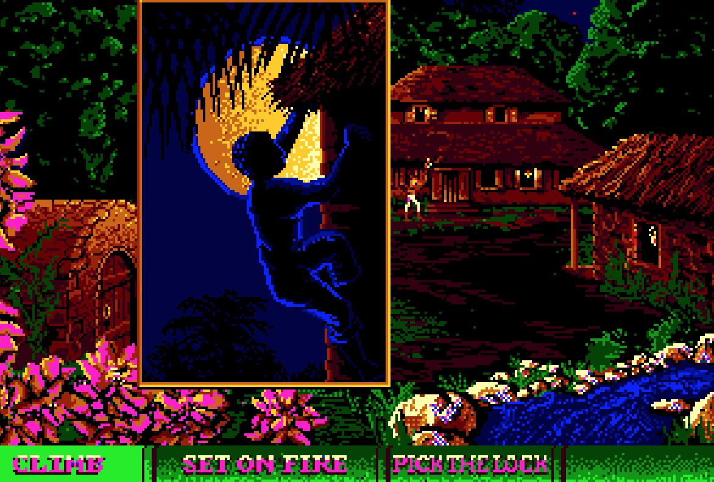

<!-- Main -->

<!-- One -->
<section id="one">
	

		<header class="major">
			<h2>Description</h2>
		</header>
		
Human beings have been playing games for as long as they have been telling stories. In this course, students will explore the capacity of both games and literature to inform our understanding of the world, and for shaping our relationships to each other and ourselves. Part hands-on gaming studio, part literature seminar—students will play a range of digital and analog games while reading key works of English literature to consider the shared affordances of literature and games: as frameworks for play, mechanisms for world-building, and equipment for living.

		
In this course, we will read works in several popular genres of fiction including fantasy literature, detective fiction, and horror. In each case, we’ll analyze the historical intersections of literary tradition and form in relation to the influence these popular genres have had on games and gaming culture. First, we’ll read selected works by J.R.R. Tolkien to trace the fantasy genre’s historical origins in myths, legends, and fairy tales, and consider how the narrative strategies of fantasy writing have been reproduced, or subverted, by role-playing and open-world adventure games. Next, we will look to detective fiction's distinctive approach to narrative form which stretches across both literary and gaming cultures. We will read a classic short novel by Arthur Conan Doyle to reveal how the formulaic building-blocks of the murder mystery (e.g., finding clues, mapping social space) mirror the investigative mechanics of social deduction games. Finally, we’ll consider the classic horror stories of Bram Stoker and H.P. Lovecraft to examine patterns of narrative fragmentation and the mechanics of hidden information, using them as keys to understanding anxieties about gendered bodies in Victorian England and the psychopathology of race in modern America.

	

</section>

<!-- Two -->
<section id="two" class="spotlights">
	<section>
		
		

			

				<header class="major">
					<h3>Week 1 - Introduction to the Course</h3>
				</header>
				
Overview of Course Materials and Peer Introductions

				
<strong>Review</strong> <a href="https://uncch.instructure.com/courses/64653/files/?preview=8283733" target="_blank">Syllabus</a>

				
<strong>Discuss:</strong> Nguyen, "Games: Agency as Art"; Burke, "Literature as Equipment for Living"

				
<strong>Readings</strong> <a href="https://uncch.instructure.com/courses/64653/files/folder/Readings" target="_blank">Accessible via Canvas</a>

			

		

	</section>
	<section>
		
		

			

				<header class="major">
					<h3>Week 2 - Frameworks for Play</h3>
				</header>
				
<strong>Discuss:</strong> Salen & Zimmerman, "Meaningful Play" and Jagoda, "Experimental Play"; Chang, 					"Close Play" and Flanagan, "Critical Play"

				
<strong>Play:</strong> <em>Stardew Valley</em> and <em>Settlers of Catan</em>; <em>Octodad</em> and 					<em>Disco Elysium</em>

				
 <strong>Readings</strong> <a href="https://uncch.instructure.com/courses/64653/files/folder/Readings" target="_blank">Accessible via Canvas</a>
				

			

		

	</section>
	<section>
		
		

			

				<header class="major">
					<h3>Week 3 - Tolkien and the Fantasy Tradition</h3>
				</header>
				
<strong>Myth, Legend, and Fairy Tale</strong>
				

				
<strong>Discuss:</strong> Tolkien, "On Fairy Stories" and "Mythopoeia"

				
 <strong>Readings</strong> <a href="https://uncch.instructure.com/courses/64653/files/folder/Readings" target="_blank">Accessible via Canvas</a>
				

			

		

	</section>
	<section>
		
		

			

				<header class="major">
					<h3>Week 4 - Open World Building</h3>
				</header>
				
<strong>Space, Place, and the Epic</strong>
				

				
<strong>Play:</strong> <em>The Witcher III</em>
				

				
<strong>Discuss:</strong> Defoe, <em>Robinson Crusoe</em> (1719)

			

		

	</section>
	<section>
		
		

			

				<header class="major">
					<h3>Week 5 - Narrative Architecture</h3>
				</header>
				
<strong>Textual Ruins and Metafictional Gestures</strong>
				

				
<strong>Discuss:</strong> Equiano, <em>The Interesting Narrative</em> (1789)
				

				
<strong>Play:</strong> <em>Settlers of Catan</em>; <em>Puerto Rico</em>
				

				
 <strong>Readings</strong> <a href="https://uncch.instructure.com/courses/50647/files/folder/readings" target="_blank">Accessible via Canvas</a>

			

		

	</section>
		<section>
		
		

			

				<header class="major">
					<h3>Week 6 - Character Creation</h3>
				</header>
				
<strong>Agency and Self-Invention</strong>
				

				
<strong>Discuss:</strong> James, <em>Toussaint Louverture - The Story of the Only Successful Slave Revolt in History</em> (1934)
				

				
W 02/14 - pp.49-133
				

			

		

	</section>
		<section>
		
		

			

				<header class="major">
					<h3>Week 7 - Playing in Faerie</h3>
				</header>
				
<strong>Roleplay and Collaborative Storytelling</strong>
				

				
<strong>Discuss:</strong> James, <em>The Black Jacobins</em> (1938)
				

				
<strong>Play:</strong> <em>Assassin's Creed: Freedom Cry</em>
				

				
 <strong>Readings</strong> <a href="https://uncch.instructure.com/courses/50647/files/folder/readings" target="_blank">Accessible via Canvas</a>

			

		

	</section>
		<section>
		
		

			

				<header class="major">
					<h3>Week 8 - Clues in the Classic Detective Story</h3>
				</header>
				
<strong>The Mechanics of the Mystery Formula</strong>
				

				
<strong>Discuss:</strong> Goldstein Sepinwall from <em>Slave Revolt on Screen</em> (2021)
				

				
<strong>Play:</strong> <em>Freedom: Rebels in the Dark</em>
				

				
 <strong>Readings</strong> <a href="https://uncch.instructure.com/courses/50647/files/folder/readings" target="_blank">Accessible via Canvas</a>

			

		

	</section>
		<section>
		
		

			

				<header class="major">
					<h3>Week 9 - Playing at Murder, and Investigation</h3>
				</header>
				
<strong>Social Deduction Games</strong>
				

				
<strong>Discuss:</strong> Conan Doyle, <em>The Hound of the Baskervilles</em> (1902)
				

				
M 03/04 - pp.3-70
				

				
W 03/06 - pp.70-143
				
 
			

		

	</section>
		<section>
		
		

			

				<header class="major">
					<h3>Week 10 - Playing with Memory</h3>
				</header>
				
<strong>Gothic Fiction and Literary Form</strong>
				

				
<strong>Discuss:</strong> Todorov, "The Typology of the Detective Story" (1966)
				

				
<strong>Play:</strong> <em>Blood on the Clocktower</em>
				

				
 <strong>Readings</strong> <a href="https://uncch.instructure.com/courses/50647/files/folder/readings" target="_blank">Accessible via Canvas</a>

			

		

	</section>
		<section>
		
		

			

				<header class="major">
					<h3>Week 11 - Cosmic Horror</h3>
				</header>
				
<strong>The Psychopathology of Race</strong>
				

				
<strong>Discuss:</strong> Chandler, <em>The Big Sleep</em> (1939)
				

				
M 03/25 - pp.3-119
				

				
W 03/27 - pp.120-231
				
 
			

		

	</section>
		<section>
		
		

			

				<header class="major">
					<h3>Week 12-14 - Project Development</h3>
				</header>
				
<strong>Detections of Totality</strong>
				

				
<strong>Discuss:</strong> Lynch, "The City Image and its Elements" from <em>The Image of the City</em> (1960)
				

				
<strong>Play:</strong> <em>Disco Elysium</em>
				

			

		

	</section>
		<section>
		
		

			

				<header class="major">
					<h3>Week 15 - Thanksgiving Holiday</h3>
				</header>
				
<strong>Queer Joy and Recuperative History</strong>
				

				
<strong>Discuss:</strong> Flanagan, <em>Critical Play</em> (2009) [selections]
				

				
<strong>Play:</strong> <em>Molly House</em>
				

				
 <strong>Readings</strong> <a href="https://uncch.instructure.com/courses/50647/files/folder/readings" target="_blank">Accessible via Canvas</a>

			

		

	</section>
		<section>
		
		

			

				<header class="major">
					<h3>Week 16 - Conclusion to the Course</h3>
				</header>
				
<strong>Course Wrap-Up and Feedback Survey</strong>
				

				
<strong>Submit:</strong> Portfolio Contributions <strong>DUE Monday, 05/06</strong>
				

			

		

	</section>
</section>

