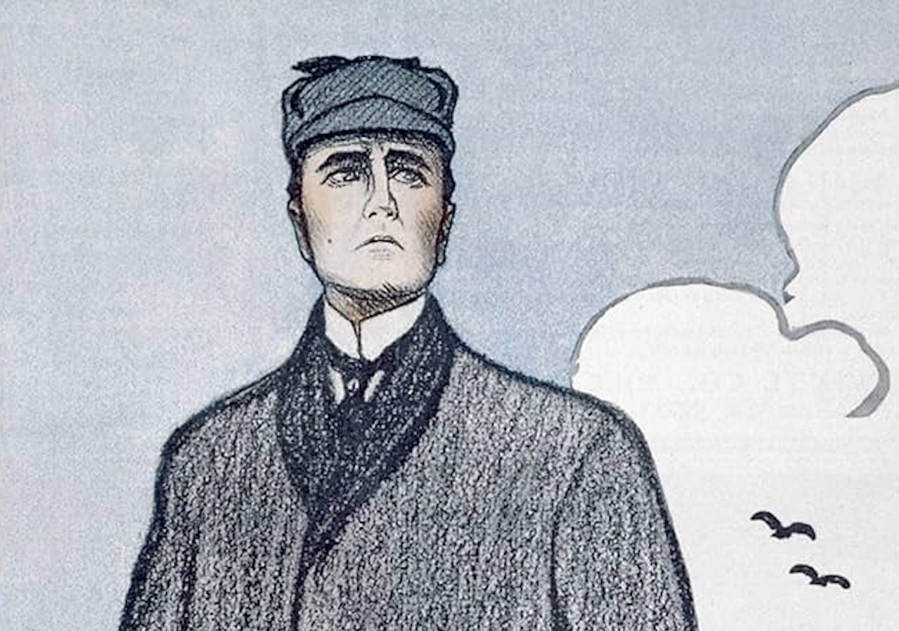
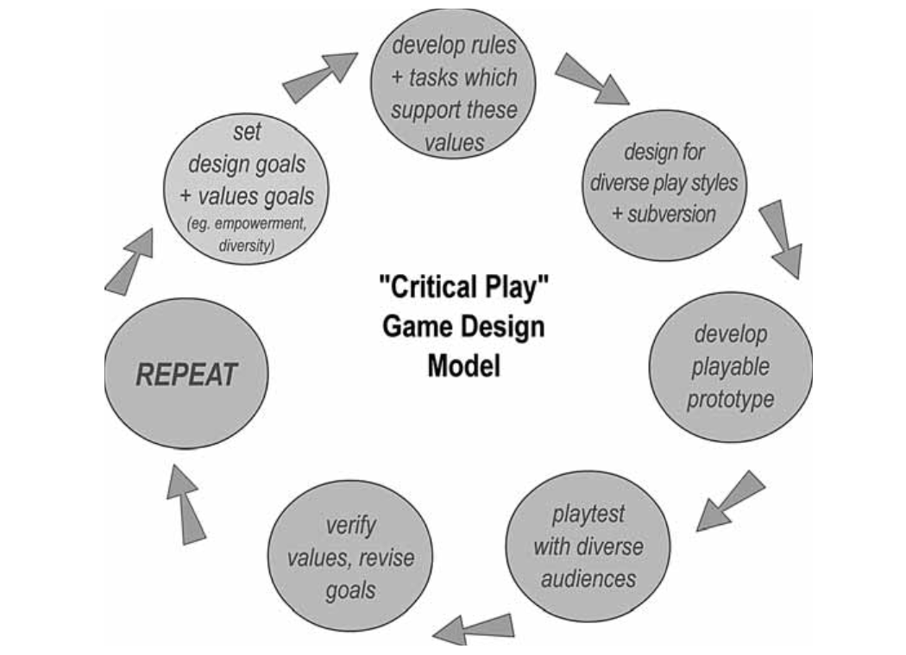

<!-- Main -->

<!-- One -->
<section id="one">
	

		<header class="major">
			<h2>Description</h2>
		</header>
		
Human beings have been playing games for as long as they have been telling stories. In this course, students will explore the capacity of both games and literature to inform our understanding of the world, and for shaping our relationships to each other and ourselves. Part hands-on gaming studio, part literature seminar—students will play a range of digital and analog games while reading key works of English literature to consider the shared affordances of literature and games: as frameworks for play, mechanisms for world-building, and equipment for living.

		
In this course, we will read works in several popular genres of fiction including fantasy literature, detective fiction, and horror. In each case, we’ll analyze the historical intersections of these popular genres with games and gaming culture. First, we’ll read from selected works by J.R.R. Tolkien to trace the fantasy genre’s historical origins in myth, legend, and fairy tales, and explore how the genre conventions of fantasy writing have been reproduced, or subverted, by role-playing and open-world adventure games. Next, we’ll look to detective fiction's use of narrative form, uncovering a distinctive approach that stretches across both literary and gaming cultures. We will read a classic short novel by Arthur Conan Doyle to reveal how the formulaic building-blocks of the murder mystery (e.g., finding clues, mapping social space) mirror the investigative mechanics of social deduction games. Finally, we’ll consider the classic horror stories of Bram Stoker and H.P. Lovecraft to examine patterns of textual fragmentation and the mechanics of hidden information, using them as keys to understanding anxieties about gendered bodies in Victorian England and the psychopathology of race in modern America.

	

</section>

<!-- Two -->
<section id="two" class="spotlights">
	<section>
		
		

			

				<header class="major">
					<h3>Week 1 - Introduction to the Course</h3>
				</header>
				
Overview of Course Materials and Peer Introductions

				
<strong>M - 08/19</strong> Review <a href="https://uncch.instructure.com/courses/64653/files?preview=8341834" target="_blank">Course Syllabus</a>

				
<strong>W - 08/21</strong> Discuss Nguyen and Burke

				
<strong>Readings</strong> <a href="https://uncch.instructure.com/courses/64653/files/folder/Readings" target="_blank">Accessible via Canvas</a>

			

		

	</section>
	<section>
		
		

			

				<header class="major">
					<h3>Week 2 - Frameworks for Play</h3>
				</header>
				
<strong>M - 08/26</strong> Discuss Salen & Zimmerman and Jagoda; Play <em>Stardew Valley</em> and <em>Settlers of Catan</em>

				
<strong>W - 08/28</strong> Discuss Chang and Flanagan; Play <em>Octodad</em> and <em>Disco Elysium</em>

				
 <strong>Readings</strong> <a href="https://uncch.instructure.com/courses/64653/files/folder/Readings" target="_blank">Accessible via Canvas</a>
				

			

		

	</section>
	<section>
		
		

			

				<header class="major">
					<h3>Week 3 - Tolkien and the Fantasy Tradition</h3>
				</header>
				
<strong>Myth, Legend, and Fairy Tale</strong>
				

				
<strong>M - 09/02 LABOR DAY</strong>

				
<strong>W - 09/04</strong> Discuss Tolkien, "On Fairy Stories" and "Mythopoeia"

				
 <strong>Readings</strong> <a href="https://uncch.instructure.com/courses/64653/files/folder/Readings" target="_blank">Accessible via Canvas</a>
				

			

		

	</section>
	<section>
		
		

			

				<header class="major">
					<h3>Week 4 - Open World Building</h3>
				</header>
				
<strong>Space, Choice, and Epic Story-telling</strong>
				

				
<strong>M - 09/09</strong> Play and Discuss <em>The Witcher III</em>
				

				
<strong>W - 09/11</strong> Discuss Tolkien, <em>The Silmarillion</em> (1977) and <em> The Hobbit</em> (1937)

				
<strong>Readings</strong> <a href="https://uncch.instructure.com/courses/64653/files/folder/Readings" target="_blank">Accessible via Canvas</a>

			

		

	</section>
	<section>
		
		

			

				<header class="major">
					<h3>Week 5 - Narrative Architecture</h3>
				</header>
				
<strong>Textual Ruins and Metafictional Gestures</strong>
				

				
<strong>M - 09/16</strong> Discuss Tolkien, <em>The Lord of the Rings</em> (1954-5)
				

				
<strong>W - 09/18</strong> Play and Discuss <em>The Witcher III</em>
				

				
<strong>Readings</strong> <a href="https://uncch.instructure.com/courses/64653/files/folder/Readings" target="_blank">Accessible via Canvas</a>

			

		

	</section>
		<section>
		
		

			

				<header class="major">
					<h3>Week 6 - Character Creation</h3>
				</header>
				
<strong>Agency and Self-Invention</strong>
				

				
<strong>M - 09/23 WELLNESS DAY</strong> 

				
<strong>W - 09/25</strong> Discuss Peterson, "The Two Cultures" and <em>Dungeons and Dragons, 1st Ed.</em>

				
<strong>Readings</strong> <a href="https://uncch.instructure.com/courses/64653/files/folder/Readings" target="_blank">Accessible via Canvas</a>

			

		

	</section>
		<section>
		
		

			

				<header class="major">
					<h3>Week 7 - Playing in Faerie</h3>
				</header>
				
<strong>Roleplay and Collaborative Storytelling</strong>
				

				
<strong>M - 09/30</strong> Character Creation Exercise

				
<strong>T - 10/01 EXT Play</strong> <em>Wanderhome</em>
				

				
<strong>W - 10/02</strong> Discuss <em>Wanderhome</em>

			

		

	</section>
		<section>
		
		

			

				<header class="major">
					<h3>Week 8 - Clues in the Classic Detective Story</h3>
				</header>
				
<strong>The Mechanics of the Mystery Formula</strong>
				

				
<strong>M - 10/07</strong> Discuss Todorov, "The Typology of Detective Fiction"

				
<strong>W - 10/09</strong> Discuss Conan Doyle <em>The Hound of the Baskervilles</em> (1902)
				

				
<strong>Readings</strong> <a href="https://uncch.instructure.com/courses/64653/files/folder/Readings" target="_blank">Accessible via Canvas</a>

			

		

	</section>
		<section>
		
		

			

				<header class="major">
					<h3>Week 9 - Playing at Murder, and Investigation</h3>
				</header>
				
<strong>Social Deduction Games</strong>
				

				
<strong>M - 10/14</strong> Lying to Your Friends is Fun!
 
				
<strong>T - 10/15 EXT Play</strong> <em>Blood on the Clocktower</em>

				
<strong>W - 10/16</strong> Discuss <em> Blood on the Clocktower</em>

			

		

	</section>
		<section>
		
		

			

				<header class="major">
					<h3>Week 10 - Playing with Memory</h3>
				</header>
				
<strong>Gothic Fiction and Literary Form</strong>
				

				
<strong>M - 10/21</strong> Discuss Stoker, <em>Dracula</em> (1897)
				

				
<strong>W - 10/23</strong> Play <em>Thousand-Year-Old Vampire</em>
				

				
<strong>Readings</strong> <a href="https://uncch.instructure.com/courses/64653/files/folder/Readings" target="_blank">Accessible via Canvas</a>

			

		

	</section>
		<section>
		
		

			

				<header class="major">
					<h3>Week 11 - Cosmic Horror</h3>
				</header>
				
<strong>Lovecraft & the Psychopathology of Race</strong>
				

				
<strong>M - 10/28</strong> Discuss Lovecraft, "The Call of Cthulhu" and "The Dunwich Horror"
				

				
<strong>T - 10/29 EXT Play</strong> <em> Unfathomable</em>

				
<strong>W - 10/30</strong> Discuss <em>Unfathomable</em>

				
<strong>Readings</strong> <a href="https://uncch.instructure.com/courses/64653/files/folder/Readings" target="_blank">Accessible via Canvas</a>

			

		

	</section>
		<section>
		
		

			

				<header class="major">
					<h3>Week 12-14 - Project Development</h3>
				</header>
				
<strong>From Proposal to Prototype</strong>
				

				
<strong>M/W - 11/04-06</strong> Goal Setting and Group Formation

				
<strong>M/W - 11/11-13</strong> Research and Design Workshops

				
<strong>M/W - 11/18-20</strong> Production and Prototyping Workshops

			

		

	</section>
		<section>
		
		

			

				<header class="major">
					<h3>Week 15 - Thanksgiving</h3>
				</header>
				
<strong>Holiday Break</strong>
				

				
<strong>M - 11/25</strong> Progress Report Check-In DUE

				
<strong>W - 11/27</strong> NO CLASS

			

		

	</section>
		<section>
		
		

			

				<header class="major">
					<h3>Week 16 - Conclusion to the Course</h3>
				</header>
				
<strong>Course Wrap-Up and Feedback Survey</strong>
				

				
<strong>M - 12/02</strong> Playtesting Workshop

				
<strong>W - 12/04</strong> Conclusion

			

		

	</section>
</section>

